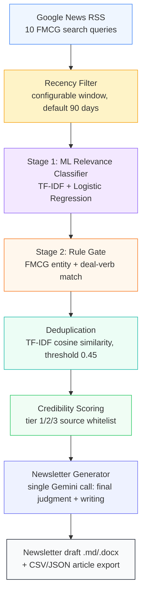

# FMCG Deal Intelligence

An end-to-end pipeline that ingests live FMCG industry news, filters it down to genuine M&A/investment activity, deduplicates near-identical coverage, scores source credibility, and generates a structured newsletter draft — with a Streamlit dashboard to run and inspect the whole thing.

**Demo:** https://fmcg-newsletter.streamlit.app/
**Repo:** https://github.com/scariadon5/FMCG-Deal-Intelligence

---

## Architecture



Only one stage (Newsletter Generator) calls an LLM. Every stage before it — relevance, deduplication, credibility — is classical ML or deterministic rules, which keeps the pipeline auditable and keeps token usage to a few thousand tokens per run rather than per article.

## What it does

1. **Ingest** — Pulls live articles from Google News RSS across 10 FMCG-focused search queries (no API key, no LLM tokens spent here).
2. **Recency filter** — Drops anything older than 30 days based on the article's real publish date, since RSS ranking alone doesn't guarantee freshness.
3. **Stage 1: relevance filter** — A TF-IDF + Logistic Regression classifier, trained on ~3,290 labeled headlines, predicts whether an article is deal-related at all.
4. **Stage 2: FMCG + deal-verb gate** — A rule-based check confirms the article names a specific FMCG entity *and* uses deal language (acquires, stake, merger, etc.), catching what the ML model alone can't guarantee.
5. **Deduplication** — TF-IDF cosine similarity clusters near-duplicate coverage of the same deal (e.g. Reuters and Economic Times both covering "Dabur buys Fem Care"), keeping the most complete version.
6. **Credibility scoring** — Sources are tiered against an explicit, auditable whitelist (Reuters/Bloomberg/ET = tier 1, general press = tier 2, everything else = tier 3), not learned — trustworthiness isn't something a model should infer from article text alone.
7. **Newsletter generation** — A single LLM call (Gemini) does a final judgment pass over the surviving articles — silently dropping anything that isn't a genuine transaction (earnings commentary, brand rankings, etc. that merely *mention* "investment") — and writes the structured draft, with every deal linked back to its source article and dated.

This is the only LLM call in the entire pipeline. Everything upstream is classical ML/rules, which keeps the pipeline auditable, cheap to run, and easy to explain stage-by-stage.

---

## Pipeline logic in detail

### De-duplication
Articles are vectorized with TF-IDF and compared pairwise via cosine similarity. Any pair above a **0.45 similarity threshold** is treated as covering the same underlying deal. Clusters are built transitively (if A is similar to B, and B to C, all three cluster together), and the **longest article per cluster is kept** as a simple, defensible proxy for "most complete source."

*Known limitation:* transitive clustering can occasionally over-merge — if A~B and B~C but A and C aren't actually similar to each other, they still end up in one cluster. For short news headlines this is rare in practice, but it's a real edge case worth knowing about.

### Relevance filtering (two-stage, not one)
Relevance is deliberately split into two independent checks rather than one model doing everything:
- **Stage 1 (ML)** asks: does this sound financially/deal-like at all?
- **Stage 2 (rules)** asks: is this *specifically* an FMCG company's deal?

Splitting them means each stage is independently debuggable — if something wrong slips through, you can tell which stage's logic to fix rather than treating the model as a black box. Stage 2 also maintains a `STRONG_FMCG_COMPANIES` list that overrides sector-exclusion checks when a real acquirer is named (avoiding false exclusions like "Fem Care **Pharma**" being wrongly filtered as a pharma-sector story).

### Credibility
Simple three-tier whitelist (see `src/pipeline/credibility_scoring.py`). Nothing is dropped outright by default — everything is scored and ranked, so the newsletter surfaces tier-1-sourced deals first without silently discarding tier-3 coverage.

### Newsletter generation
One Gemini call, capped at the top 40 articles by credibility score (keeps token usage predictable regardless of how much raw news came in). The model does a final relevance pass (catching things like "impairment charge" mentions that Stage 2's keyword logic can't distinguish from real deals) and writes the newsletter in a fixed markdown structure, grouped by acquiring company.

---

## Known assumptions & limitations (stated transparently)

- **Recency is enforced explicitly, not left to RSS ranking.** Google News RSS itself has no `after:`/`before:` date operator, so a dedicated recency filter runs immediately after ingestion (`run_pipeline.py`), parsing each article's real `pubDate` and dropping anything older than **30 days** (configurable via `RECENCY_DAYS`) before Stage 1 even runs. Articles with an unparseable or missing date are dropped rather than assumed recent, since a "real-time" claim shouldn't rest on an unverifiable date. The newsletter header also displays the actual covered date range, computed directly from the surviving articles' dates (not LLM-guessed), so the claimed window is always accurate.
- **Every deal in the newsletter links back to its source article** and shows its publication date — the LLM is instructed to copy each article's exact URL verbatim (never invent or alter one) and cite each contributing source as its own dated markdown link.
- **Stage 1 training data is limited** — 105 positive examples (some Gemini-bootstrapped paraphrases) out of ~3,290 labeled rows. It generalizes reasonably in practice (backed by Stage 2's rule gate as a safety net), but hasn't been validated against a held-out live batch it's never seen.
- **Credibility tiers are a fixed whitelist**, not automatically maintained — adding a new reputable source requires manually editing the list.

---

## Outputs

- **Raw filtered dataset**: downloadable as CSV or JSON directly from the dashboard (Exports section), or found at `data/processed/final_articles.csv` / `.json` after any pipeline run.
- **Newsletter draft**: markdown, downloadable from the dashboard, or found at `outputs/newsletter_drafts/newsletter_<date>.md`.
- **Funnel summary**: per-stage article counts (ingested → Stage 1 → Stage 2 → dedup → final) saved to `data/processed/funnel_summary.json`, shown in the dashboard's pipeline view.

---

## Running it locally

```bash
git clone https://github.com/scariadon5/FMCG-Deal-Intelligence.git
cd FMCG-Deal-Intelligence
python -m venv venv
source venv/bin/activate   # or venv\Scripts\activate on Windows
pip install -r requirements.txt
```

Create a `.env` file in the project root with your Gemini API key:
```
GEMINI_API_KEY=your_key_here
```

Then run:
```bash
streamlit run app/streamlit_app.py
```

Open the dashboard and click **Generate Newsletter** — this triggers live ingestion, runs the full pipeline, and writes a fresh newsletter draft. It takes a few minutes since it's fetching live news, not reading cached data.

---

## Project structure

```
app/                    # Streamlit dashboard
  components/           # UI components (deal cards, pipeline view, newsletter render, exports)
  styles/main.css        # Design system (CSS variables, cards, layout)
src/
  pipeline/              # Core pipeline: ingestion, stage2 rules, dedup, credibility, newsletter gen
  training/               # Stage 1 classifier training script
  labeling/               # LLM-assisted labeling for training data
  data_prep/              # Training dataset construction
models/                  # Trained classifier + vectorizer (.pkl)
data/
  labeled/                # Training data
  processed/              # Pipeline outputs (final_articles.csv/json, funnel_summary.json)
outputs/newsletter_drafts/ # Generated newsletter markdown files
```
